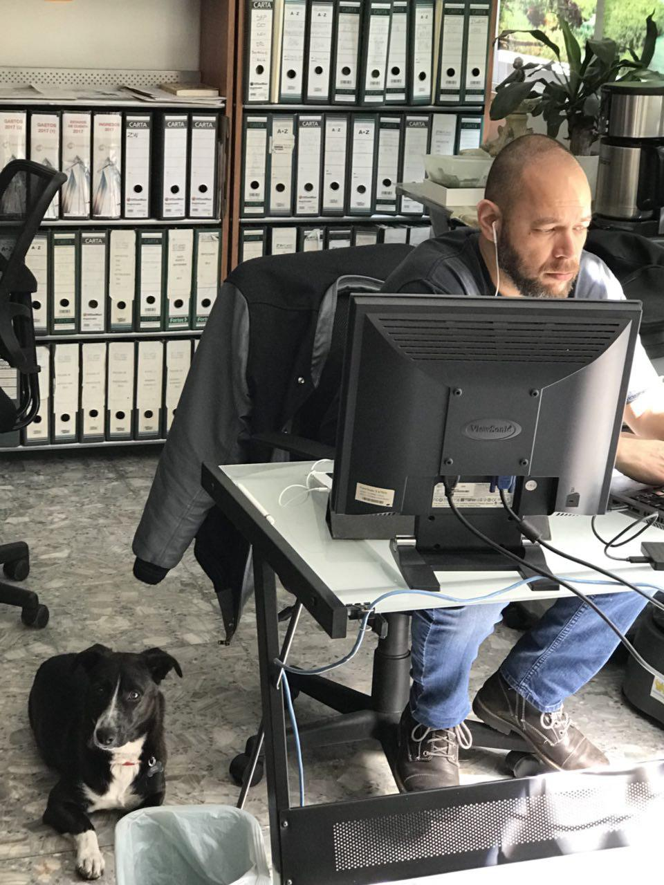

**BIOGRAFIA**

***JOSE RAMON BORBOLLA LUNA***

Nació el 6 de Febrero de 1971 en la ciudad de México. Creció en un hogar junto a su madre, su tía y tres hermanos, dos mayores y una hermana menor, lo que le brindó una perspectiva diversa desde una edad temprana.

*EDUCACION*
- Su educación primaria y secundaria se llevó a cabo en instituciones que seguían el modelo educativo *"Activo"*, desafiando así el paradigma tradicional de la enseñanza. Esta experiencia lo expuso a un enfoque más dinámico y participativo en el aprendizaje.

- Al concluir la secundaria, José Ramón ingresó a una preparatoria *"ex-militarizada"*, donde experimentó un entorno educativo completamente diferente, en contraste con el modelo *"Activo"*. Esta transición lo desafió y enriqueció su perspectiva sobre la educación y el aprendizaje.

- Decidido a seguir su pasión por la arquitectura, ingresó a la ***Universidad Autónoma de México***, donde se graduó en esta disciplina. Desde una edad temprana, mostró interés y habilidad en el campo de la arquitectura y la construcción, y comenzó a trabajar en este sector a la edad de 19 años, en 1990. A lo largo de los años, ha acumulado una amplia experiencia trabajando en constructoras, despachos y diversos proyectos arquitectónicos.
  
*TRAYECTORIA*
En el año 2007, José Ramón fundó la empresa ***Borgio Arquitectos, SA de CV***, una compañía dedicada al desarrollo de proyectos arquitectónicos y a la venta de software, particularmente dentro de la línea de *"SolucionesCAD"*. Desde entonces, ha liderado la empresa, combinando su pasión por la arquitectura con su habilidad para desarrollar herramientas tecnológicas que mejoren los procesos de diseño y gestión de proyectos. Paralelamente, ha desarrollado aplicaciones de software CAD con LISP para automatizar procesos y mejorar la eficiencia en el desarrollo y la administración de proyectos arquitectónicos.

José Ramón Borbolla Luna es un arquitecto apasionado y emprendedor, comprometido con la innovación y la excelencia en su campo. Su trayectoria profesional es un testimonio de su dedicación, habilidad y visión en la arquitectura y la tecnología.

*PARTICIPACIONES*
1. Proyecto de telecomunicaciones de la compañía *ALESTRA y AT&T* en México.
2. Desarrollo de proyectos para el sector salud en laboratorios de *TOXINA Y TOXOIDE*
3. Desarrollo de aplicación para el cálculo unifilar en redes de telecomunicaciones en cobre y fibra óptica
4. Desarrollo de aplicaciones para la automatización de cuantificación de materiales y administración de estandares.
5. Desarrollo de aplicación de traza urbana y localización de infraestructura para software CAD y google Earth.
6. Construcción de torres residenciales en Cancún, Quintana Roo.

